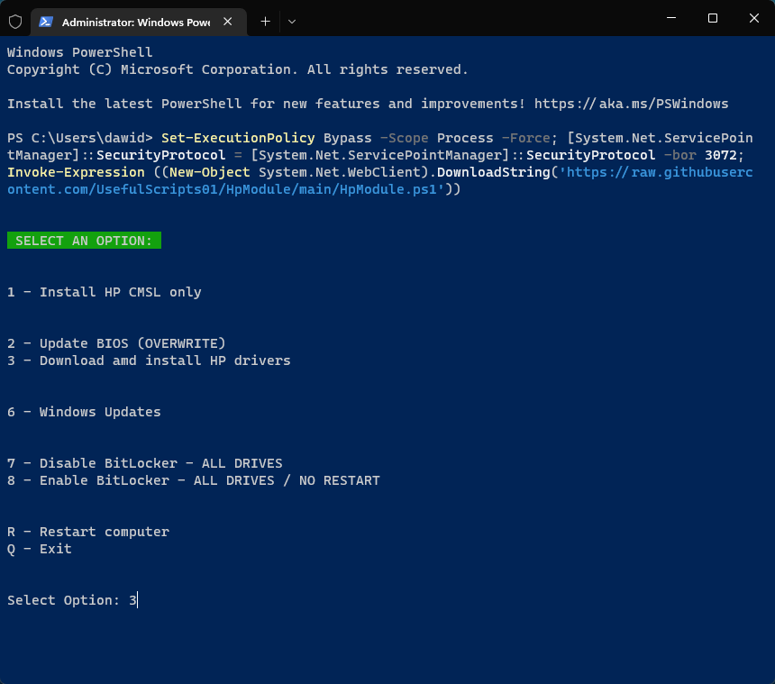
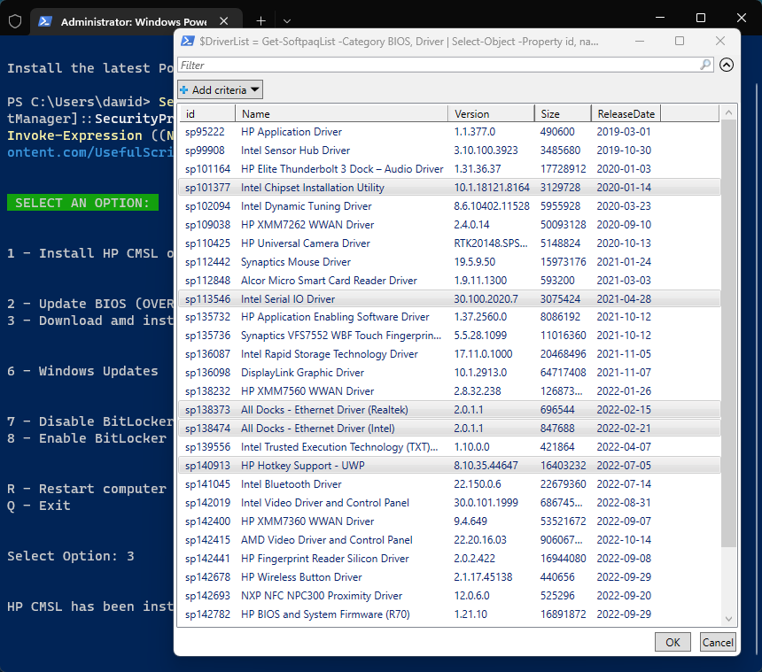

## Description
More info: https://developers.hp.com/hp-client-management/doc/client-management-script-library

# Usage

Copy the code from the area below and paste it into PowerShell Admin (or Windows Terminal)

```powershell
Set-ExecutionPolicy Bypass -Scope Process -Force; [System.Net.ServicePointManager]::SecurityProtocol = [System.Net.ServicePointManager]::SecurityProtocol -bor 3072; Invoke-Expression ((New-Object System.Net.WebClient).DownloadString('https://raw.githubusercontent.com/UsefulScripts01/HpTool/main/HpTool.ps1'))
```

</img>

## 3 - HP Drivers

Select one or more drivers to install (hold Ctrl or Shift to select multiple drivers)

</img>

Wait while the selected drivers are installed
